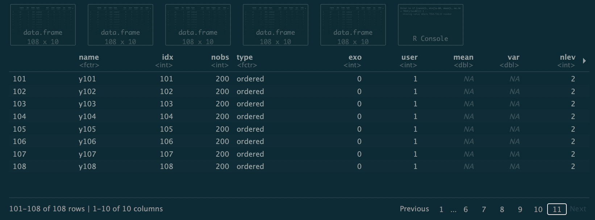
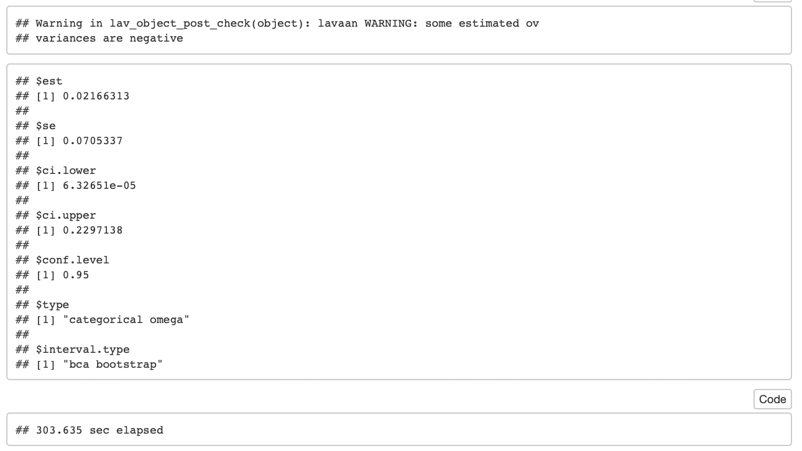
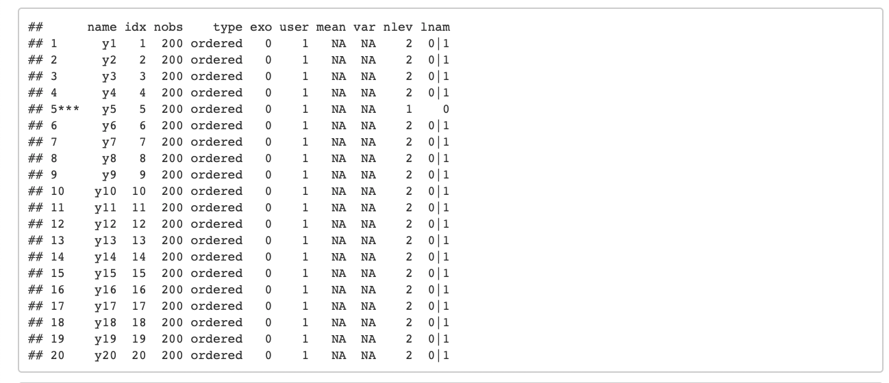
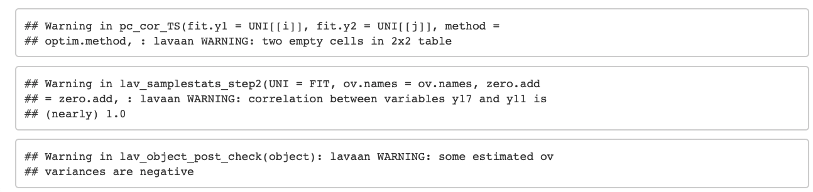
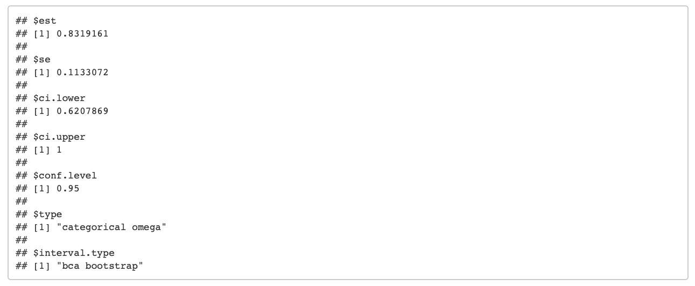
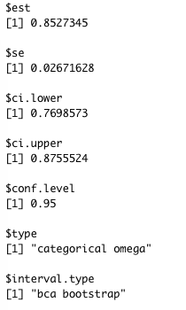

-----

__Code written:__ 2019-11-30  
__Last run:__ `r Sys.Date()`   
__Authors:__ Navona Calarco & Colin Decker  
__Website:__ https://rpubs.com/navona/Mar_categoricalOmegaTesting  
__Git repo:__ https://github.com/navonacalarco/NRC_Mar  
__R version laptop:__ platform: x86_64-apple-darwin15.6.0, arch: x86_64, os: darwin15.6.0, system: x86_64, darwin15.6.0, major: 3, minor: 5.3, year: 2019, month: 03, day: 11, svn rev: 76217, language: R, version.string: R version 3.5.3 (2019-03-11), nickname: Great Truth  
__R version desktop:__ platform: x86_64-apple-darwin15.6.0, arch: x86_64, os: darwin15.6.0, system: x86_64, darwin15.6.0, major: 3, minor: 5.1, year: 2018, month: 07, day: 02, svn rev: 74947, language: R, version.string: R version 3.5.1 (2018-07-02), nickname: Feather Spray  
__R version CAMH:__ platform: x86_64-pc-linux-gnu, arch: x86_64, os: linux-gnu, system: x86_64, linux-gnu, major: 3, minor: 5.0, year: 2018, month: 04, day: 3, svn rev: 74626, language: R, version.string: R version 3.5.0 (2018-04-23), nickname: Joy in Playing  

-----

__Description.__  
This notebook details our attempts to obtain categorical omega reliability estimates and CIs on data from Dr. Mar's NRC study. We intend to estimate omega/CIs separately for subscales (as global scales are not unidimesional). 

__Relevant papers we read.__  
Dunn et al. (2013)      
Green and Yang (2009)      
Kelley and Pornprasertmanit (2016)      
McDonald (1999)    

__Relevant documentation__.  
https://www.rdocumentation.org/packages/MBESS/versions/4.6.0/topics/ci.reliability #MBESS  
https://github.com/cran/MBESS/blob/master/R/ci.reliability.R #code underlying ci.reliability()  

-----

__Setup.__

```{r setup}

#conditional install and load libraries
if (!require("pacman")) install.packages("pacman")
pacman::p_load(MBESS, tictoc, lavaan)

#read in test df
df_fict <- read.csv(dir('../NRC_data/out', full.names=T, pattern="^df_fict_"))
df_nonf <- read.csv(dir('../NRC_data/out', full.names=T, pattern="^df_nonf_"))
df_foil <- read.csv(dir('../NRC_data/out', full.names=T, pattern="^df_foil_"))

```

-----

####Attempt 1
We start by looking at the `fict` subscale of the ART, which is a 108x200 matrix (_m_=variables, _n_=observations). 

We try to use the MBESS function `ci.reliability` with the `type='categorical'` argument. We use `interval.type == 'bca'`, short for "bias corrected and accelerated bootstrap", which is recommended for categorical omega in Kelley and Pornprasertmanit (2016). These settings calculate coefficient omega for categorical items by accounting for both item covariances and item thresholds using Green and Yang's formula (2009, formula 21). 

Note: We will ultimately want to use 1000 or 10,000 bootstraps, but in the interest of computing time, we are testing with B=220. We chose this number with the belief that `B` must be greater than the number of observations/rows in the dataset. And it was easy to remember. 

```{r 1}

#categorical
#ci.reliability(data=df_fict, type="categorical", conf.level = 0.95, interval.type="bca", B=220)

```

__Outcome.__ The code runs for a bit. We can see the following output if we run interactively in RStudio:


<br>

This output tells us that some iterations have run, as we see several temp dfs are created (all of dimension 108x10). But, after a short period of time (<30 seconds) we get the following error: `Error in if (const(t, min(1e-08, mean(t, na.rm = TRUE)/1e+06))) { :  missing value where TRUE/FALSE needed`
  
We expect that this error is related to the fact that, in our statistical output, we see `mean` and `var` could not be calculated (are all NAs), which is likely an upshot of the fact that some variables in our data have 0 variance (i.e., all participants answered 'no').

We see something else strange: it seems that the number of created dfs created is 222 (31 rows of 7 dataframes in each row = 217 dataframes, plus an extra 5 in a 32nd row). However, we expected 220 dfs, given that we specified `B` = 220...
 
-----

####Attempt 2
Since we are pretty sure that some of our problems are related to features of our data (namely having some variables with 0 variance), we remove those variables from our dataset.

```{r}

#remove the variables with 0 variance
df_fict_no0var <- df_fict[, colSums(df_fict != 0) > 0] #we have 0 variance if all scores are equal to 0; we lose 2 variables

#rerun the same omega model as above
#ci.reliability(data=df_fict_no0var, type="categorical", conf.level = 0.95, interval.type="bca", B=220)

```

__Outcome__. The code still fails; this time, R crashes after several minutes. No warnings. No idea...

-----

####Attempt 3

We wonder if there's some other feature of our data that's weird but yet undiscovered. We decide to create toy data (that shares overall features with our real ART fiction data), and try our code on that.

```{r 3}

#make toy dataset
set.seed(123) #reproducible
test_1 <- as.data.frame(matrix(rbinom(200*108,1,0.5),200, 108)) #same features of data (mxn, binary)

#run the same code as above
#ci.reliability(data=test_1, type="categorical", conf.level = 0.95, interval.type="bca", B=220)

```

__Outcome__. Again, R crashes after several minutes, without any error output. Perhaps we have too many variables compared to observations ... we didn't expect this would be an issue, but it may be. 

-----

####Attempt 4

We want to test if we have too many variables _m_ compared to our number of observations _n_.  We arbitrarily make our data smaller (_m_=20) and run the same code as before. This should also help with runtime (which we will capture with the `tictoc` library).

```{r}

#make smaller df
test_2 <- test_1[, 1:20]

#start timer
#tic()

#run the same code as above
#ci.reliability(data=test_2, type="categorical", conf.level = 0.95, interval.type="bca", B=220)

#end timer
#toc()

```

__Outcome__. OMG! We actually have results! 



We have warning from `lavann` about negative variances, but this may be OK if the negative variances are small. We also see that with _m_=20, our code took 303.635 seconds (~5 minutes to run) on my laptop of questionable strength, so that's not too bad. 

-----

####Attempt 5

Spurred on by our success above, we try to run our code on a smaller subset (again, _m_=20) of our real ART fiction data. First, we try data without the two variables with 0 variance. 

```{r}

#take m=20 from our real data, without any variables with 0 variance
test_3 <- df_fict_no0var[, 1:20]

#run the same code as above
#ci.reliability(data=test_3, type="categorical", conf.level = 0.95, interval.type="bca", B=220)

```

__Outcome__. We get the following error: 


This error comes from the `bca.ci`, which is called by `boot.out`, which is called by `MBESS`. We have see this error before, in other contexts. The error is related to not having enough bootstrap iterations. [More info here](https://stats.stackexchange.com/questions/37918/why-is-the-error-estimated-adjustment-a-is-na-generated-from-r-boot-package). So, we'll try the same code with more iterations.

-----

####Attempt 6
We run the same code, again on 20 variables from our real ART fiction data (with potentially problematic 0 variance variables excluded), this time with 1000 iterations. We'll also record the time it takes to run this code, if it works. 

```{r}

#tic()

#run the same code as above, but with more iterations
#ci.reliability(data=test_3, type="categorical", conf.level = 0.95, interval.type="bca", B=1000)

#toc()

```

__Outcome:__ The code runs! It takes 884.91 seconds (14.7485 minutes) to run. We have a _huge_ amount of output. Essentially, we have 1000 instances of the chunk below, one for each bootstrap iteration: 



Here, we see the the `mean` and `var` columns in the statistical output are again NA, as in 'Attempt 1'. But, our code ran, and we seem (below) to have reasonable omega and CI estimates (?), so maybe, it's not the case that the NA values in the `mean` and `var` columns aren't a problem...?

We also see that, in some output, some variables have an `nlev` (number of levels) values of 1, whereas most others have 2. The variables with `nlev` of 1 are indicated by `***`. There is some pattern to the variables that are flagged (e.g., 5 appears a lot, but not always), but there is variability between chunks. This is a result of the partial resampling randomly selecting a subset that results in no variance, we think...

At the bottom of several of the 1000 boostrap report chunks, we see warnings. Some chunks have no warnings, some have 3 or more. The warnings shown in the image below appear a lot. It seems that all warnings are limited to these 3 types. The first appears many times; the second several times, and the third a small number of times, with a small coupling of variables, always seeming to include 17 (paired with 13, 9, 11))  


Finally, after 1000 chunks of this sort, we do get output from the model: 



-----

####Attempt 7
Because we saw above that the bootstrap output indicates NA for `mean` and `var`, we are no longer confident that variables with 0 variance pose a problem for our estimate. So, we want to attempt to run our code with those 0 variance variables left in. 

```{r}

#find the 2 variables with 0 variance
which(apply(df_fict, 2, var) == 0) #vars 17 and 31 

#include them in our new df, along with 18 other vars
df_fict_small0var <- df_fict[, c(1:19, 31)]

#run the same code as above
#ci.reliability(data=df_fict_small0var, type="categorical", conf.level = 0.95, interval.type="bca", B=1000)

```

__Outcome.__ The code fails, quickly, with the error below, which seems to confirm that variables with 0 variance do pose a problem for estimates. We will have to do something about these problematic variables when we analyze our data.


-----

####Attempt 8

Now, we are wondering if we have a problem with variables with low variance, in addition to no variance. Here, we omit 80% of variables, that have the lowest variance (80% is arbitrary). We expect this code should work since we known running with 20 variables work, and omitting the bottom 80% will leave us with 23 variables. We want to compare our omega and CI estimates. 

```{r}

#get a vector of variances
variances <- apply(FUN=var, df_fict, MARGIN=2)

#calculate how many variables to omit
cutoff_1 <- round(ncol(df_fict)*0.8) #86

#order the variances, and keep the n-32 largest ones
highVar_1 <- order(variances)[cutoff_1:ncol(df_fict)]

#make a new df with only relatively high variance variables
df_fict_highVar_1 <- df_fict[, highVar_1]

#run the same code on our new data
#ci.reliability(data=df_fict_highVar_1, type="categorical", conf.level = 0.95, interval.type="bca", B=1000)

```

__Outcome__. As expected, our code works. Our statistic is as follows:



We do have one warning: 


We think that this is indicates that our categorical distribution is 'poorly behaved', and thus that we may want to increase the number of bootstrap interations even more, maybe to 10,000.  Otherwise extreme percentiles of the resampling distribution used in calculations may be / will be too inaccurate. Alternatively, we may be able to decrease the CI from 95% to 90%. However, we are not sure why we see this error now, and not when we were using variables with lower average variance ... will need to look into this. 

-----

__References__

Dunn, T. J., Baguley, T., & Brunsden, V. (2013). From alpha to omega: a practical solution to the pervasive problem of internal consistency estimation. _Br J Psychol._, 105(3), 399-412. [doi](https://doi.org/10.1111/bjop.12046)

Green, S. B., & Yang, Y. (2009). Reliability of summed item scores using structural equation modeling: An alternative to coefficient alpha. _Psychometrika_, 74(1), 155--167. [doi](https://doi.org/10.1007/s11336-008-9099-3)

Kelley, K. & Pornprasertmanit, P. (2016). Confidence intervals for population reliability coefficients: Evaluation of methods, recommendations, and software for homogeneous composite measures. _Psychological Methods_, 21(1), 69-92. [doi](https://doi.org/10.1037/a0040086)

McDonald, R. P. (1999). _Test theory: A unified approach_. Mahwah, New Jersey: Lawrence Erlbaum Associates, Publishers.

-----


